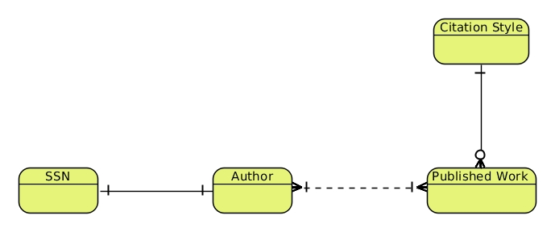
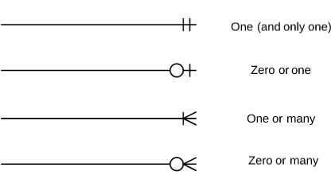
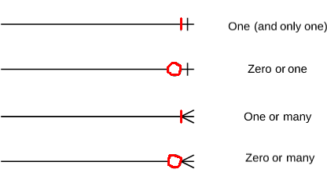
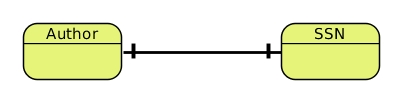

class: center, middle

# Models to ERDs

---

## Goals

- Quick review of model relationships
- Entity Relationship Diagram
- Crow's Foot notation

---

## Model Relationships (Review)                                                        

### Three types:                                                  

--

- One to One

--

- One to Many (same as: Many to One)

--

- Many to Many

---

## Entity Relationship Diagram

.center[Shows relationships between entities and/or tables]

--

.center[ERDs uses **Crow's Foot Notation** to describe relationships]

---

## ERDs: Cardinality & Ordinality

.larger[Cardinality]

**Maximum** number of times an instance in one entity can be associated with instances in the related entity.

--

.larger[Ordinality]

**Minimum** number of times an instance in one entity can be associated with an instance in the related entity

---

## ERD: Cardinality

Maximum number of times an instance in one entity can be associated with instances in the related entity.

.center[]

- One to One
- One to Many
- Many to Many

---

## ERD: Cardinality

**Maximum** number of times an instance in one entity can be associated with instances in the related entity.

.center[]

- .red[One] to .red[One]
- .red[One] to .red[Many]
- .red[Many] to .red[Many]

.center.larger[Words in .red[red] describe the Cardinality]

---

## ERDs: Ordinality

**Minimum** number of times an instance in one entity can be associated with an instance in the related entity

.center[]

---

## ERDs: Ordinality

**Minimum** number of times an instance in one entity can be associated with an instance in the related entity

.center[]

--

.center[.red[Ordinality] is added to the Cardinality notation.]

---

## One to One

.larger[Example]

- An Author can only have one SSN
- Likewise, a SSN can only be assigned to one Author

--

.center[]

--

.center[The Ordinality is missing. What should it be? Discuss.]

---

## One to Many                                                         

.larger[Example]

- A **Published Work** can only have one **Citation Style**
- However, a **Citation Style** can be used with many Published Works

--

.center[]

---

## Many to Many

.larger[Example]

- An Author can have more than one Published Work
- A Published Work can have more than one Author

--

.center[]

---                                                                             

## Example: Facebook

.center.larger[Discuss the likely relationships between the models: **User**, **StatusUpdate**, **Photo** and **Profile**]

--

- How can we represent "Friends"? How about the Ordinality of Friends?

--

- How can we represent Comments on **StatusUpdates**?

---

## Example: Chinook

.center.larger[Create an ERD for the Chinook Database including the Ordinality]
